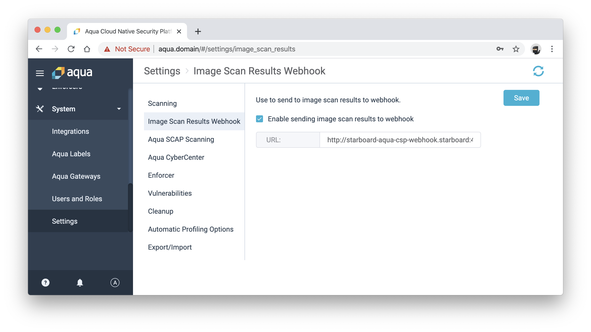

# Starboard Aqua CSP Webhook

This webhook is the image scan results webhook configurable in Aqua CSP management console to integrate with the
[Starboard] tool kit.

## TOC

- [Getting started](#getting-started)
- [How does it work?](#how-does-it-work)
- [Configuration](#configuration)
- [License](#license)

## Getting started

1. Build Docker image:
   ```
   $ make docker-build
   ```
2. Deploy webhook on Kubernetes in the `starboard` namespace:
   ```
   $ kubectl apply -f ./kube/webhook.yaml
   ```
3. Create custom resource definitions used by Starboard:
   ```
   $ kubectl starboard init
   ```
   or
   ```
   $ kubectl apply -f https://github.com/aquasecurity/k8s-security-crds/blob/master/kube/crd/vulnerabilities-crd.yaml
   ```
4. Configure Starboard webhook in Aqua CSP management console:

   

## How does it work?

The webhook transforms received scan report to an instance of the `vulnerabilities.aquasecurity.github.com` resource
and saves it in the `starboard` namespace. The name of the resource is the image digest.

```
$ kubectl get vulnerabilities -n starboard
NAME                                                                      AGE
sha256.ef74351b551c96630769bf9278845bcf7f71417850f0b3d240d99003573200cd   10s
```

```yaml
apiVersion: aquasecurity.github.com/v1alpha1
kind: Vulnerability
metadata:
  name: sha256.ef74351b551c96630769bf9278845bcf7f71417850f0b3d240d99003573200cd
  namespace: starboard
report:
  generatedAt: "2020-04-17T18:44:37Z"
  scanner:
    name: Aqua CSP
    vendor: Aqua Security
  summary:
    criticalCount: 14
    highCount: 2
    lowCount: 7
    mediumCount: 0
    unknownCount: 0
  vulnerabilities:
  - description: runuser in util-linux allows local users to escape to the parent
      session via a crafted TIOCSTI ioctl call, which pushes characters to the terminal's
      input buffer.
    fixedVersion: ""
    installedVersion: 2.29.2-1+deb9u1
    links:
    - https://web.nvd.nist.gov/view/vuln/detail?vulnId=CVE-2016-2779
    - https://security-tracker.debian.org/tracker/CVE-2016-2779
    resource: "runuser"
    severity: CRITICAL
    vulnerabilityID: CVE-2016-2779
```

## Configuration

Configuration of the webhook is done via environment variables at startup.

| Name                                    | Default     | Description                        |
| --------------------------------------- | ----------- | ---------------------------------- |
| `STARBOARD_WEBHOOK_LOG_LEVEL`           | `info`      | The log level of `trace`, `debug`, `info`, `warn`, `warning`, `error`, `fatal` or `panic`. The standard logger logs entries with that level or anything above it.
| `STARBOARD_WEBHOOK_API_ADDR`            | `:4000`     | Binding address for the API server |
| `STARBOARD_WEBHOOK_STARBOARD_NAMESPACE` | `starboard` | Starboard namespace                |

## License

This repository is available under the [Apache License 2.0](https://github.com/aquasecurity/starboard-aqua-csp-webhook/blob/master/LICENSE).

[starboard]: https://github.com/aquasecurity/starboard
